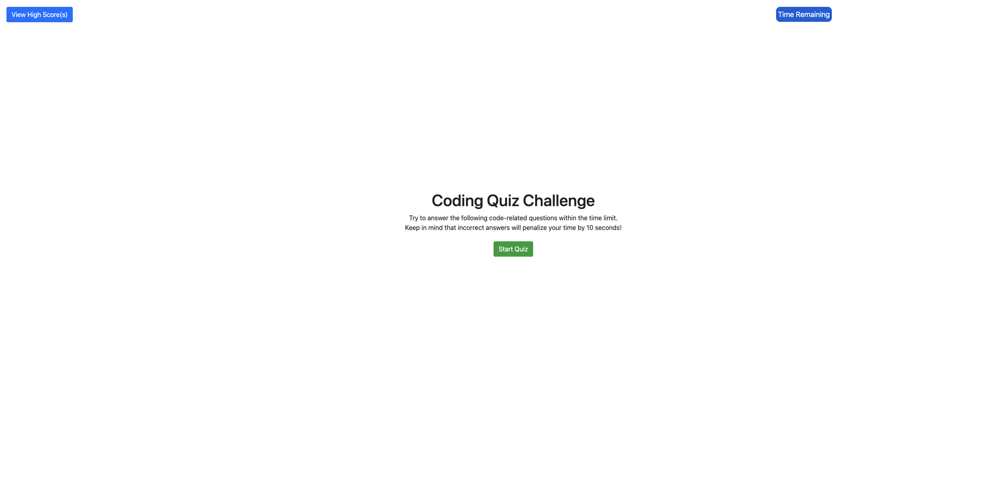
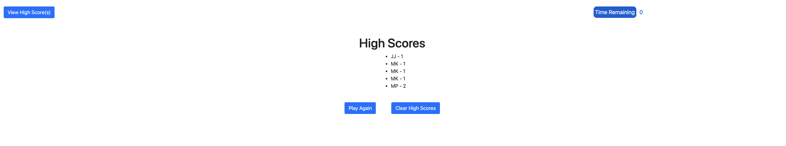

# Code-Quiz-HW4

Coding Quiz

What is this?
A multiple choice coding quiz that keeps highscores in local storage, initates a timer when the quiz is started and reduces time remaining when an incorrect answer is selected.

Live Link: https://mattp303.github.io/Weather-Dashboard/

Developer contact: mattmakescode@gmail.com

License: MIT

What does it look like?

